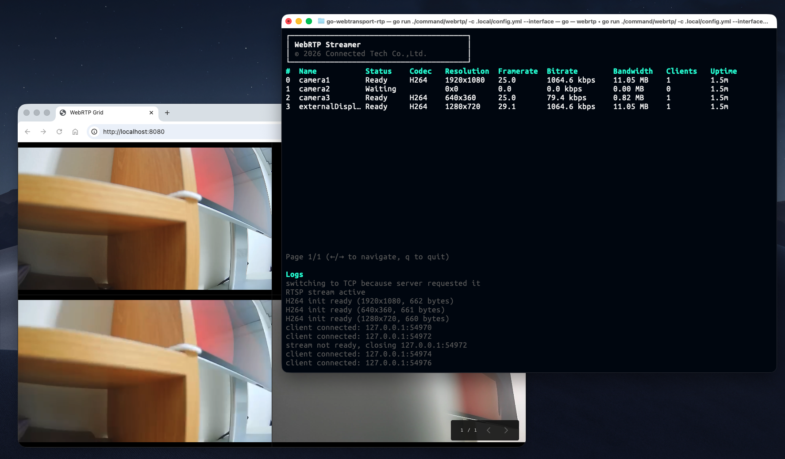

# go-webrtp

Golang library for streaming RTP packet from RTSP source directly to web in real-time.

## Screenshot



## Usage

### Download Binary

Download the latest release binary from [GitHub Releases](https://github.com/connectedtechco/go-webrtp/releases):

- macOS (Apple Silicon)
   ```bash
   curl -L -o webrtp https://github.com/connectedtechco/go-webrtp/releases/latest/download/webrtp-darwin-arm64
   chmod +x webrtp
   ```
  
- Linux (x64)
   ```bash
   curl -L -o webrtp https://github.com/connectedtechco/go-webrtp/releases/latest/download/webrtp-linux-amd64
   chmod +x webrtp
   ```
- Windows (x64)
   ```powershell
   Invoke-WebRequest -Uri "https://github.com/connectedtechco/go-webrtp/releases/latest/download/webrtp-windows-amd64.exe" -OutFile webrtp.exe
   ```

### Run Server

```bash
./webrtp -i -c config.yml
```

### Command Options

```
  -c, --config string    Config file path (default: config.yml)
  -i, --interface       Use graphical interface (default: false)
  -p, --port int        HTTP server port (default: 8080)
```

### Configuration

Create a `config.yml` file:

```yaml
telemetryServiceName: streamer1     # Optional: OTEL service name (default: "webrtp")
telemetryEndpoint: "localhost:4317" # Optional: OTEL gRPC endpoint for pushing metrics
upstreams:
  - name: camera1
    rtspUrl: rtsp://192.168.1.100:554/stream
```

### Endpoint

- Web UI: http://localhost:8080/
- Stream by name: `ws://localhost:8080/stream/camera1`
- Stream by number: `ws://localhost:8080/stream/no/0`
- Metrics: http://localhost:8080/metrics
- Stream Information: http://localhost:8080/info

### Telemetry

Metrics are available at `/metrics` endpoint in Prometheus format:

- `streamer_clients{name="camera1"}` - Current number of clients
- `streamer_bitrate_kbps{name="camera1"}` - Current bitrate in Kbps
- `streamer_framerate{name="camera1"}` - Current framerate

### Embedded Server

You can embed the WebRTP handler in your own Fiber application:

```go
package main

import (
	"fmt"
	"log"

	"github.com/connectedtechco/go-webrtp"
	"github.com/gofiber/fiber/v3"
	"github.com/gofiber/fiber/v3/middleware/cors"
)

func main() {
	// Initialize WebRTP instance
	inst := webrtp.Init(&webrtp.Config{
		Rtsp:   "rtsp://192.168.1.100:554/stream",
		Logger: log.Default(),
	})

	// Connect to RTSP source
	if err := inst.Connect(); err != nil {
		log.Fatalf("connect: %v", err)
	}

	// Create Fiber app
	app := fiber.New()
	app.Use(cors.New())

	// Register WebRTP handler at /stream endpoint
	app.All("/stream", inst.Handler())

	// Start server
	log.Printf("Server started on :8080")
	log.Fatal(app.Listen(":8080"))
}
```

## Libraries

### JavaScript / TypeScript

See [client/javascript](./client/javascript) for the JavaScript client library.

```bash
npm install @connectedtechco/webrtp
```

```javascript
import { createClient } from '@connectedtechco/webrtp';

const client = createClient('ws://localhost:8080/stream/no/0');
client.render(document.getElementById('canvas'));

client.onInfo((info) => {
    console.log('Info:', info);
});

client.onFrame((frameNo, data, isKey) => {
    console.log(`Frame ${frameNo}: ${data.byteLength} bytes, keyframe: ${isKey}`);
});
```

### Python

See [client/python](./client/python) for the Python client library.

```bash
cd client/python
uv pip install -e .
```

```python
from webrtp import WebRtpClient
import cv2

client = WebRtpClient("ws://localhost:8080/stream/no/0")

# Get raw frame data with callback
client.on_raw(lambda frame_no, data, is_key: print(f"Frame: {frame_no}, size: {len(data)}"))

# Get decoded frame with callback
client.on_frame(lambda frame_no, frame: cv2.imshow('video', frame))

client.start()
```

## Development

1. Generate self-signed certificate for TLS connection

    ```bash
    mkdir -p .local
    openssl req -x509 -newkey ec -pkeyopt ec_paramgen_curve:P-256 -keyout .local/x509-key.pem -out .local/x509-cer.pem -days 365 -nodes -subj "/CN=localhost" -addext "subjectAltName=DNS:localhost,IP:127.0.0.1"
    ```

2. Build styles (run in background)

    ```bash
    sass --watch command/webrtp/index.scss:command/webrtp/index.css
    ```

3. Run the server

    ```bash
    go run ./command/webrtp/
    ```